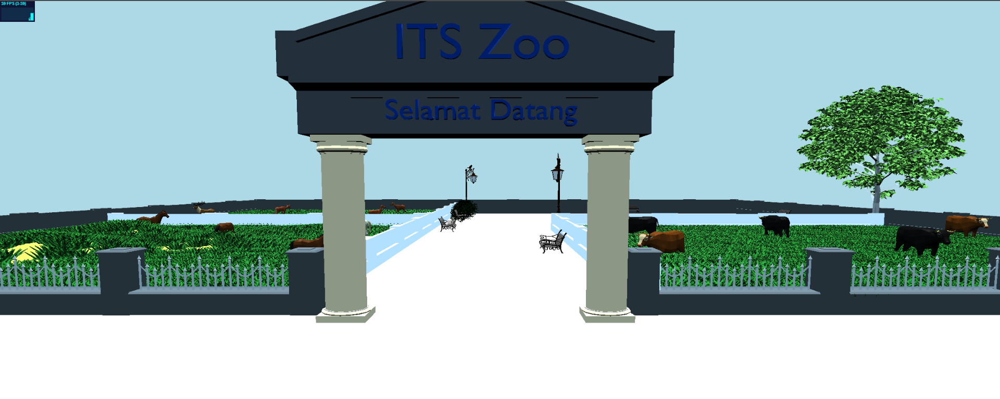
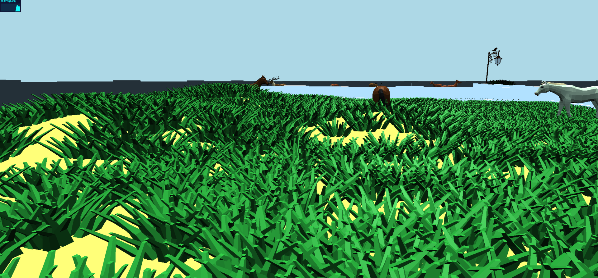
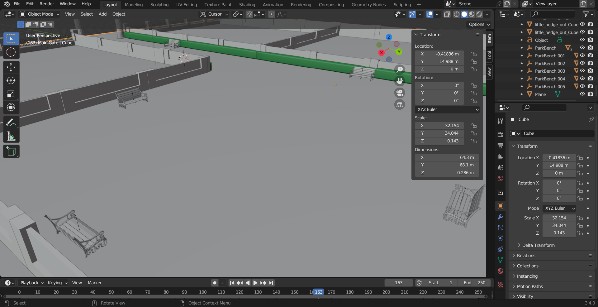

# Final Project Grafkom Kelompok 5 

|Name|Student ID|
|:----------:|:-----------:|
| 5025201004	| Danial Farros Maulana |
| 05111940000005	| Muh. Nur Fajrin Amiruddin |
| 05111940000007	| Naufal Fajar Imani |
| 05111940000157	| Kevin Davi Samuel |
| 05111940000223	| Naufal Fabian Wibowo |

# Project Preview #
Final Project ini menghadirkan replika kebun binatang yang di buat dalam threejs, pengguna bisa mengakses kebun binatang dengan controller A,W,S,D dan mouse dengan view mode First Person Controller.

# List Pengerjaan #
## Danial Farros ##
- Pembuatan layout sketsa kebun binatang
    
- Penambahan Dynamic Animal
    
- Penambahan Terain dan rumput dalam kandang
    
- Pembuatan Sketsa kolam (polos)
    
## Muh. Nur Fajrin Amiruddin ##

## Naufal Fajar Imani ##

## Kevin Davi Samuel ##
- Pembuatan kursi kebun binatang
    
## Naufal Fabian Wibowo ##